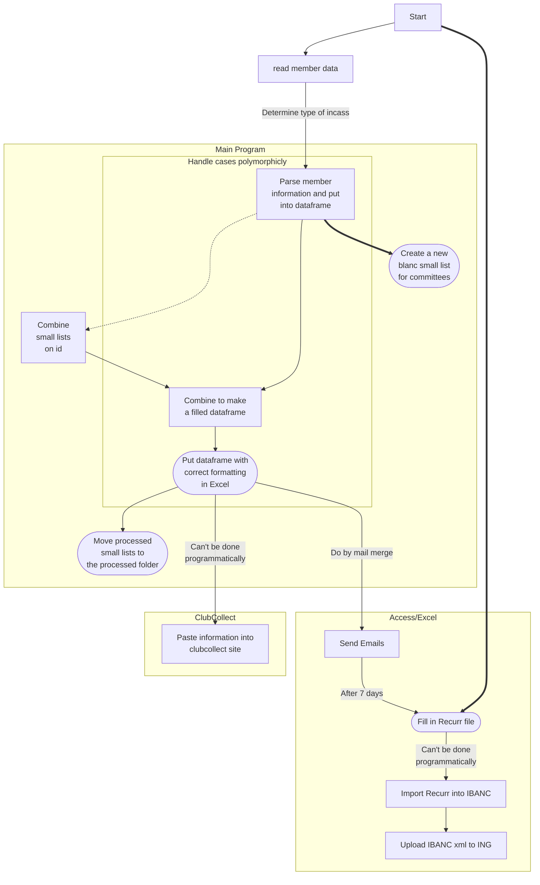

# ClubCollect Incasso

The following graph describes the flow of the incasso.

After the main program, manual action is needed, regardless of which type of member administration is used. Except for filling the Recurr file, that is something the program can do (currently not implemented). However, that option is only possible after determining that the member admin type is of the Access/Excel kind.
