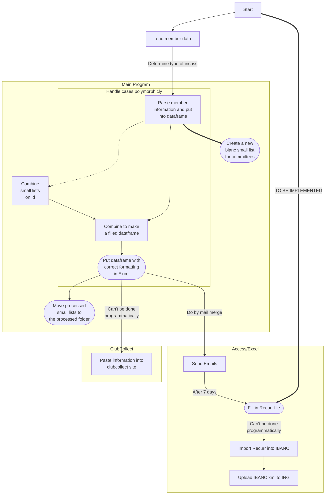

# ClubCollect Incasso

## What is this?

This command line tool has been made to aid in creating billings for D.S.J.V. Groover. It can take member data, and turn it into an excel file which can be used in the post processing.

## How does it work?

The following graph describes the flow of the incasso.

After the main program, manual action is needed, regardless of which type of member administration is used. Except for filling the Recurr file, that is something the program can do (currently not implemented). However, that option is only possible after determining that the member admin type is of the Access/Excel kind.

## General workflow

The program creates a file structure in your directory, containing the folders `Unprocessed committee lists`, `Processed committee lists`, and `Member data`. You upload the most recent version of your member data into the `Member data` folder. From here, you can generate an empty/fillable committee excel based on that member data, that you can send to committees or board members. Once they're filled with data, you put them into the `Unprocessed committee lists` folder. Then, run the program, and answer "y" to creating the final sheet, and the member data + the unprocessed committee lists will be used to create the final sheet. The "used" committee lists are moved to the `Processed committee lists` folder.

Because the program only processes excel files, it is a good idea to make dummy `.txt` files containing the incasso you plan to execute. That way, you can replace that file when the committee/board member has completed it. This has the following advantages:

1. You don't forget incasso's, because you can fill them in. It's a visual reminder that you need to remind whoever's responsible that they should fill in that excel.
2. You can create the final sheet whenever you like, and transfer over the remaining `.txt` files to your next inning.

## Details on creating and reading Committee Excels

This program has the feature to generate the fillable excels in the correct format. The format is as follows:

Created at {date}|||Totals to check:|0|0|0|0|
--|--|--|--|--|--|--|--
{Introductory message}|
ID|First name|Infix|Last name|Total|{Bedrag A}|{Bedrag B}|{Bedrag C}

If you try to insert an excel into the `Unprocessed committee lists` directory with different formatting (e.g. having the headers start at a different row, using different capitalization, spelling things differently, or having a random value in a cell where it doesn't belong, etc), the program will not parse it correctly. See the example excel in the `testing` directory for an example of how to correctly format the comittee excel.

## Build

This program is made with [pipenv](https://github.com/pypa/pipenv) and [pyinstaller](https://github.com/pyinstaller/pyinstaller). Pipenv manages the dependencies, and pyinstaller bundles the program to an executable. See the manuals for these programs for more information on how to build, the entry to this program is (unexpectedly) `main.py`.
